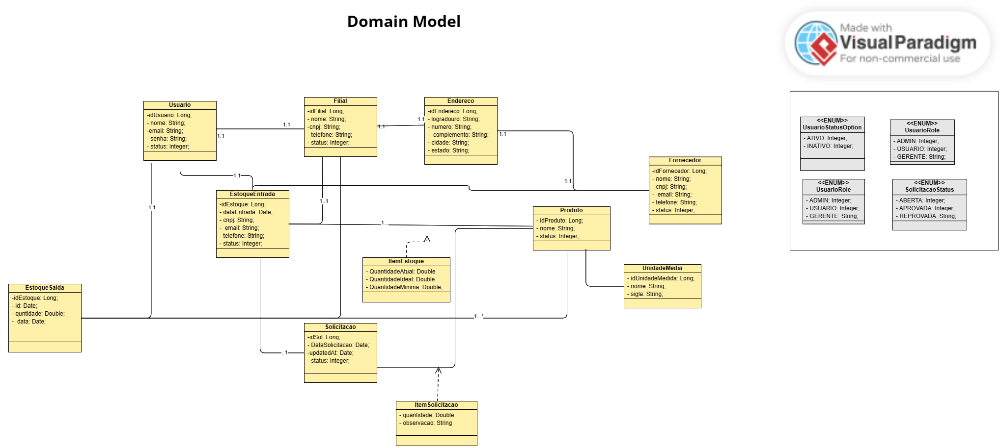
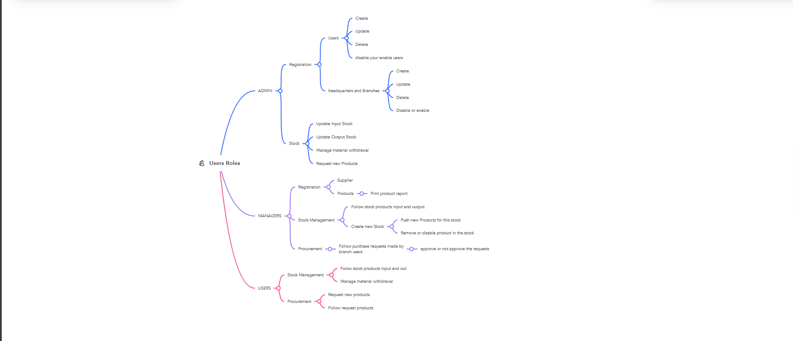
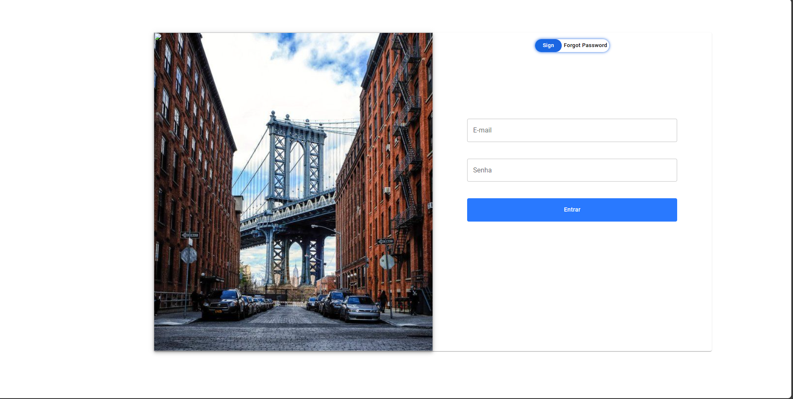
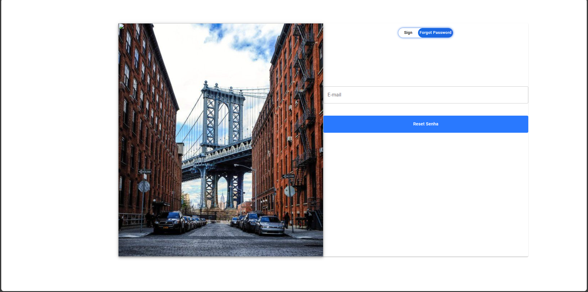
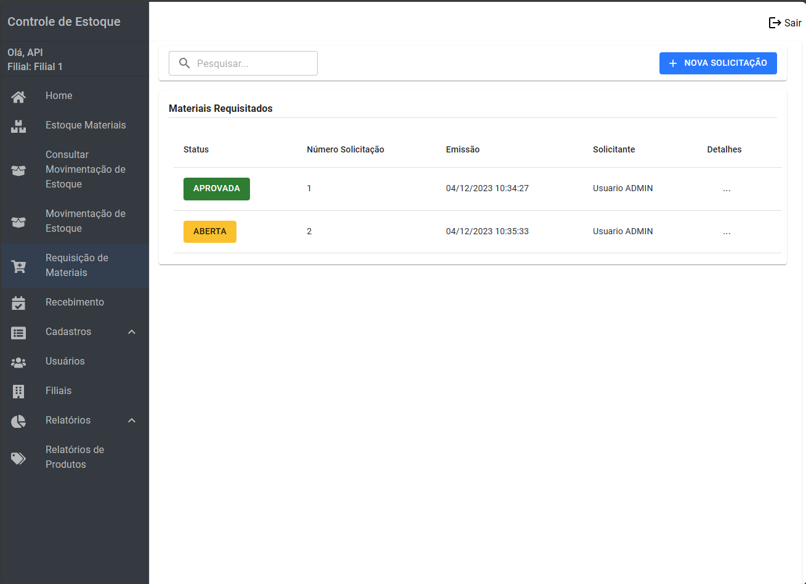
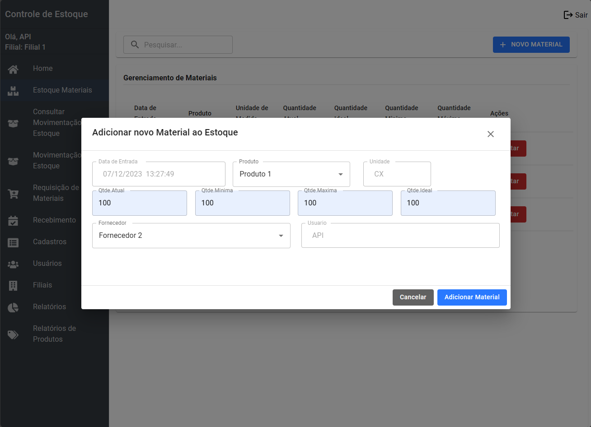
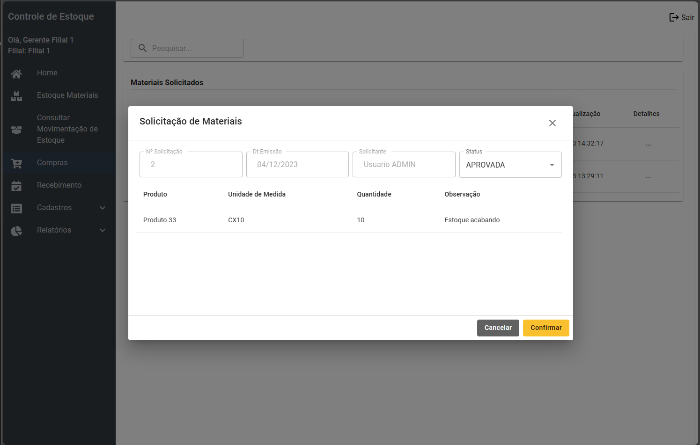

# EasyEstoque - Stock Management System
Hi there!

EasyEstoque is a Software that help you manage your stock, providing a easly interface that will help you in making-desion.

## Features
### Registration
- Users;
- Headquarter and office.
- Suppliers.
- Product.

### Inventory Management
- Stock Inquiry.
- Manage and ensure your stock.
- Update your products in the inventory.
- Manage material withdrawal.
- Ensure your supplies.
- handle with your procuremment.

## Technology
<div style="display: inline_block"><br>
    
    
    
          
    
    
  </div>

### Architecture
- MVC
- Domain Model


## Security - Roles
For this project I divided the users roles into three roles.
Check this out:



For manage all roles upon the system, I used the framework Spring Security.

## Interfaces

### Login



Here I implemented a message broker using RabbitMQ on backend, but for safety reason e remove from this current branch.


### Home


### Stock Management






## Configuration
If you want to run this application, first of all you need to set up the backend and your database, and Java JDK on your operating system.

### Database configuration
- You have to install the PostegreSQL and configure your database with user "postgres" and password with "admin". After this configure, you have to create o database with name "api" according to the application.properties. 

**For the first access** you have to insert some file into the table;
1. import the csv file into the table unidade_medida: <a href="./imgs-doc/unidade_medida.csv">unidade_medida</a>

2.  you need to insert some data on the table usuario with email "master@gmail" and passowrd hash ``` $2a$10$qRVd.6Lh7WJ3.myN3MOAVeXoUDLwW5tYgs7f0oh2VOu5Wj3PpCARW ``` your password is ``` 123 ```.
3. You have to insert data into the tables filial and endereco.

4. Go to the <a href="https://github.com/gabriel-estevam/BuildApp">BuildAPP Repositoy</a> and download the Server.

**Suggestion**: You can build the backend on Render or AWS Amazon, but you gonna have to update de ```application.properties``` acording to your remote properties and rebuild the application with  ```mvn clean package``` copy your ```app.jar``` and run ```java -jar YOUR_APP_REBUILD.jar```

## Frontend Config
For use the interfaces your have two option, but before, you need to clone this repositoy
1.  Deploy for free on <a href="https://vercel.com/">Vercel</a>
2. Run local:
```
npm run build;
npm install -g server;
server -s build;
```
I highly recommend the first option.

<br>

## ✉️ Contact
<a href = "mailto:gabriel.estevammaciel@gmail.com"></a>
<a href="https://www.linkedin.com/in/gabriel-estevam-maciel/" target="_blank"></a> 
